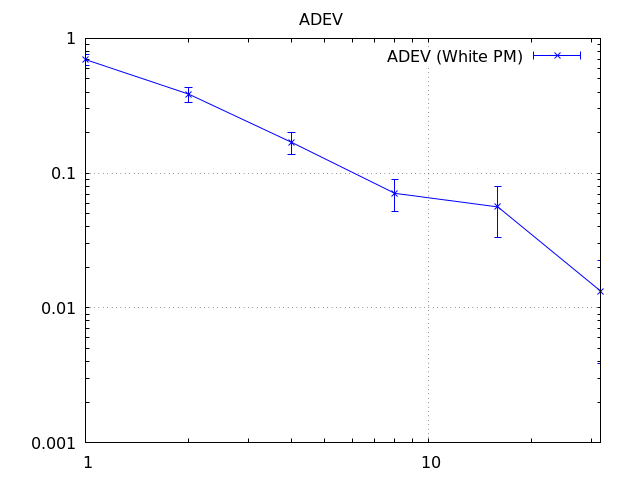
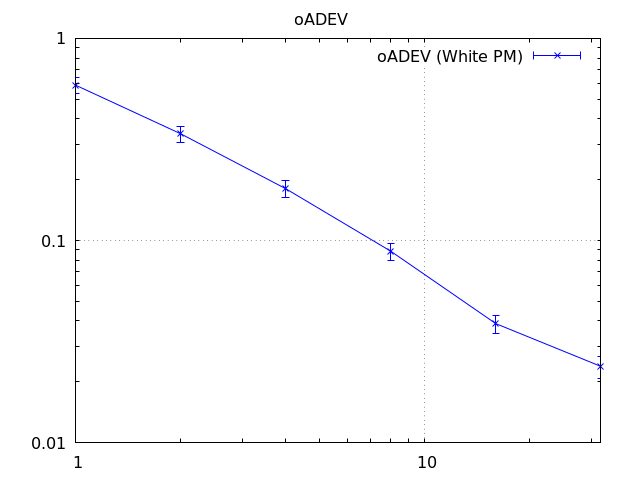
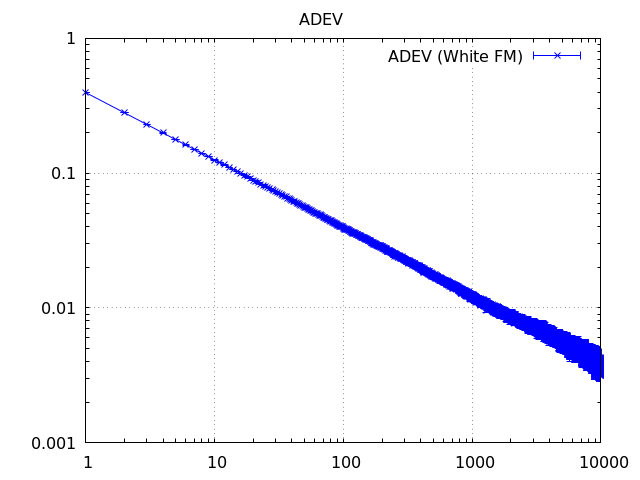
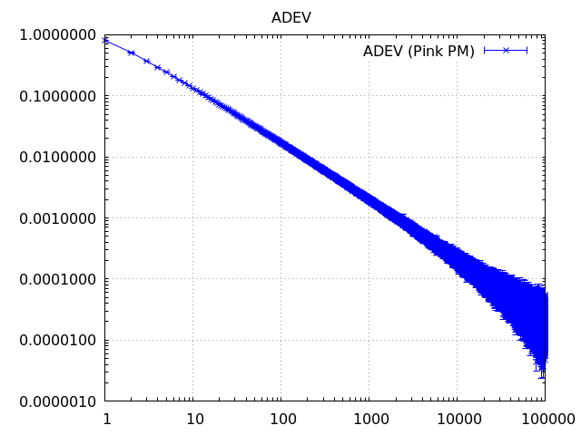
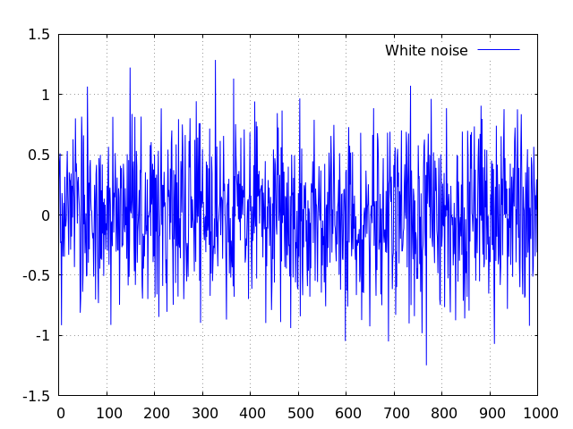
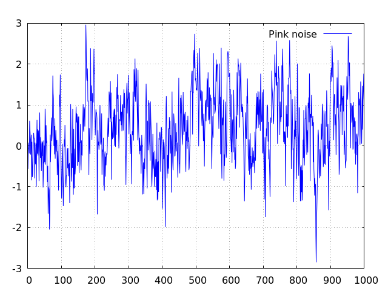

# allan-tools


[](https://github.com/gwbres/allan-tools/actions/workflows/rust.yml)
[](https://docs.rs/allan-tools/badge.svg)

[](https://crates.io/crates/allan-tools)
[](https://crates.io/crates/allan-tools)
[](https://opensource.org/licenses/Apache-2.0)

Allantools (python lib) portage to Rust

This library allows easy computations of Allan deviation & similar statistics.   
These statistical methods are mostly used in system stability studies.

### Variances / Deviations

Compute Allan Deviation over raw data:

```rust
  use allantools::*;
  let taus = tau::generator(tau::TauAxis::Octave, 128);
  let (dev, errs) = deviation(&data, taus, Deviation::Allan, false, false).unwrap();
```




Improve statiscal confidence by using _overlapped_ formulas 

```rust
  let taus = tau::generator(tau::TauAxis::Octave, 128);
  let (dev, errs) = deviation(&data, taus, Deviation::Allan, false, true).unwrap();
```



Compute Allan Deviation over a serie of fractionnal error

```rust
  let taus = tau::generator(tau::TauAxis::Octave, 10000);
  let ( adev, errs) = deviation(&data, taus, Deviation::Allan, true, false).unwrap();
  let (oadev, errs) = deviation(&data, taus, Deviation::Allan, true, true).unwrap();
```

### Tau offset and errors management
 
This library computes the requested deviation for all requested &#964; values, as long as it's feasible.   
If  &#964;(n) is not feasible (would require more input data), computations stops
and the previous valid deviations are returned (previous offsets). 

If not a single &#964; value is feasible, the lib returns Error::NotEnoughSamplesError

```rust
   let data = [0,1,2];
   assert_eq!(deviation(&data, taus, Deviation::Allan, true, false).is_err(), true);
```

If the user is passing a non valid  &#964; axis, the lib returns an error raised
by basic sanity checks

```rust
   let my_x = [-1,1,2];
   assert_eq!(deviation(&data, my_x, Deviation::Allan, true, false).is_err(), true);
```
 &#964; < 0 does not make sense

```rust
   let my_x = [0,1,2];
   assert_eq!(deviation(&data, my_x, Deviation::Allan, true, false).is_err(), true);
```
 neither does &#964; = 0 
 
 ```rust
   let my_x = [0,1,1,2];
   assert_eq!(deviation(&data, my_x, Deviation::Allan, true, false).is_err(), true);
```
the lib does not check for repeated &#964; offsets at the moment

### Tau axis generation

A Tau axis generator is embedded, for ease of use. Several axis are built in:

* TauAxis::Octave is the most efficient
* TauAxis::Decade is the standard and is efficient
* TauAxis::All requires more computation but is accurate

```rust
  let taus = tau::generator(tau::TauAxis::Decade, 10000); //log10
```



use TauAxis::All to compute the deviation for every single tau value.

```rust
  let taus = tau::generator(tau::TauAxis::All, 10000);
```




### Data & Noise generators

Some data generators were integrated or develpped for testing purposes:

* White noise generator produces scaled normal distribution

```rust
  let psd = -140; // [dBcHz]
  let fs = 10.0E6; // [Hz]
  let x = allantools::noise::white_noise(psd, fs, 10000); // 10k samples
```



* Pink noise generator produces a -10dB/dec shape when raw data is considered,
or a -5dB/dec shape if we're considering fractionnal data

```rust
  let psd = -140; // [dBcHz]
  let fs = 10.0E6; // [Hz]
  let a0_1hz = -10; // [dB] = level @ 1Hz
  let x = allantools::noise::pink_noise(a0_1hz, psd, fs, 1024); // 1k samples
```



### Tools & utilities

[NIST Power Law identification method[[46]]](https://www.nist.gov/publications/handbook-frequency-stability-analysis)   

This is a useful macro to identify noise processes contained in a data serie.  
In other words, this tells you how the data serie behaves.

```rust
  let x = produce_some_data();
  let exponents = allantools::nist_power_law_identifier(&x, None);
```

One can use the optionnal "min_dist" attribute to customize the study

```rust
  let x = produce_some_data(); // 1k symbols
  // default min_dist=10 -> 1k/10 exponents to be identified
  let exponents = allantools::nist_power_law_identifier(&x, None);
    // 1k/100 exponents to be identified
  let exponents = allantools::nist_power_law_identifier(&x, Some(100));
```

Cummulative sum (python::numpy like)
```rust
   let data: Vec<f64> = some_data();
   allantools::utilities::cumsum(data, None);
   allantools::utilities::cumsum(data, Some(10E6_f64)); // opt. normalization
```

Derivative (python::numpy like)
```rust
   let data: Vec<f64> = some_data();
   allantools::utilities::diff(data, None);
   allantools::utilities::diff(data, Some(10E6_f64)); // opt. normalization
```

Random generator: generates a pseudo random
sequence 0 < x <= 1.0
```rust
   let data = allantools::utilities::random(1024); // 1k symbols 
   println!("{:#?}", data);
```

__normalize__ : normalizes a sequence to 1/norm :
```rust
   let data: Vec<f64> = somedata(); 
   let normalized = allantools::utilities::normalize(
       data, 
       2.0_f64 * std::f64::consts::PI); // 1/(2pi)
```

__to\_fractionnal\_frequency__ : tool to convert a data serie
to a serie of fractionnal data.   
Typical use is converting raw frequency measurements (Hz) 
into fractionnal frequency (n.a):
```rust
   let data: Vec<f64> = somedata(); // sampled @ 10kHz
   let fract = allantools::utilities::to_fractionnal_frequency(data, 10E3); // :)
```

__fractionnal_integral__ : tool to integrate a serie of fractionnal data.  
Typical use is converting fractionnal frequency measurements (n.a), to phase
time (s).
```rust
   let data: Vec<f64> = somedata(); // (n.a) 
   let fract = allantools::utilities::fractionnal_integral(data, 1.0); // sampled @ 1Hz :)
```

__fractional\_freq\_to\_phase\_time__ : macro wrapper of previous function


__phase\_to\_radians__ : macro to convert phase time (s) to phase radians (rad)
```rust
   let data: Vec<f64> = somedata(); // (s)
   let data_rad = allantools::utilities::phase_to_radians(data);
```
